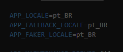
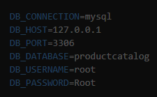
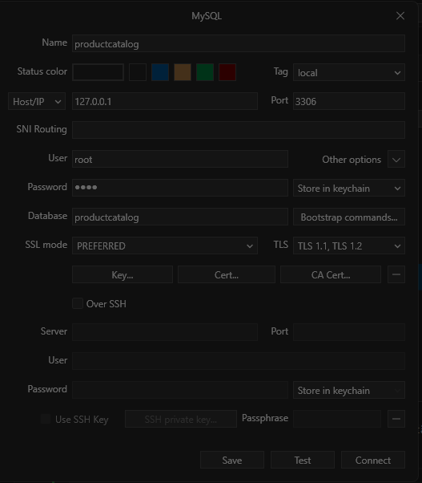

# Instruções de instalação:

- obs.: Seu computador precisar ter instalado o php, node e o composer.
- link para baixar o php: https://www.php.net/downloads
- link para baixar o node: https://nodejs.org/pt
- linl para baixar o composer: https://getcomposer.org/download/

- Passo a passo:

- Segue o link do repositório: https://github.com/Niiiela/productcatalog.git
- Execultar no terminal (visual studio code): 
* git clone https://github.com/Niiiela/productcatalog.git
* cd productcatalog
* composer install
* npm install 
* renomer o arquivo "env" para ".env" obs.: (No .env na parte do mysql nas linha DB_USERNAME= e DB_PASSWORD= deve informar o login e senha do seu mysql)
* php artisan migrate
* npm rum dev
* em outra tela de terminal: execultar o comando: php artisan serve
* Em seguida acesse o link exibido no terminal após execultar o código anterior.

# Documentação do projeto Product Catalog
Product Catalog

# Aplicativo desenvolvido com:
- PHP 8.3.13
- Laravel: 12.18.0
- MySQL Workbench 8.0 CE
- Api Resttful
- tailwindcss,
- bootstrap

# Descrição o procedimento do desenvolvimento do sistema:
Laravel
- Realizei a instalação do laravel: laravel new productcatalog;
- Would you like to install a starter kit? [No starter kit]: none
-  Which testing framework do you prefer? [Pest]: 0
- Would you like to initialize a Git repository? (yes/no) [no]: yes
- Which database will your application use? [SQLite]: mysql

obs.: Após esse procedimento, sair do visualstuduio e  acessei novamente acessando apenas a pasta do projeto baixado. 

# Configurações iniciais do laravel:
- Configuração do .env
- Apaguei o .env.example e alterei o .env
- Alterei para português

- Ainda no .env configurei o mysql

- Após a configuração do .env
- Realizei a atualização do composer instalar: Como no meu computador já está instalado o composer install apenas realizei a atualização do composer install: composer update
- Depois instalei as dependência: npm install
- Depois rodei o comando npm rum dev  e em seguida abrir outra janela do terminal e iniciei o projeto: php artisan serve

# Gerenciador do banco de dados
- Após realizar essas configurações realizei a configuração do gerenciador do banco de dados.
- O gerenciador que usei foi "TablePlus"

# Em seguida realizei a criação da Migrate e Model
- php artisan make:model Product -m
- Na migrate informei os dados que deve constar na tabela do banco de dados (id, title, contente, status, timestamps)

- No model adicionei os dados referênte a coluna no banco de dados.
- Adicionei os dados: 'title', 'content', 'status'.
- Rodei o comando para criar as migrates: php artisa migrate

#  API Controller (ProductController)
- Em seguida rodei o comando para criar a API: "php artisan make:controller Api/ProductController --api" 
- Foi realizado a configuração no controller Api, ele vai ser responsável por receber e enviar os dados para o banco de dados.

# Controller (ProductRoutController)
- Rodei o comando para criar o controller "php artisan make:controller ProductRoutController"
- Foi configurado  o controller, ele vai ser responsável por exibir as informações na tela para o usuário, por exemplo o usuário realizou o cadastro vai exibir o formulários com os campos para serem preenchidos.

# Routes
- Foi criado um arquivo api.php responsável pela rota da api. 
- No arquivo web foi editado as rotas de acesso as funções do controler ProductRoutController.

# Request
- php artisan make:request ProductRequest
- Validação do formulário

# Views
- Executei o comando php artisan make:view layout 
- Na views foi criado o arquivo layout.blade.php onde foi informado o link do tailwindcss e o bootstrap;
- Executei o comando php artisan make:view \products\index e após php artisan make:view \products\form
- Em seguida foi criado a pasta products onde foi criado os arquivos index.blade.php e form.blade.php onde foi configurado a parte visual do sistema.

Referências:
- https://laravel.com/docs/12.x
- https://www.youtube.com/watch?v=daq5S5-55Lw
- https://tailwindcss.com/
- https://getbootstrap.com/docs/5.0/getting-started/introduction/
- https://bladewindui.com/component/list-view

